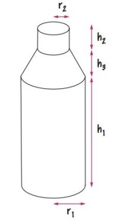

# Volume d'une bouteille

Comme illustré ci-dessous, la forme d'une bouteille peut s'approximer par deux cylindres, de rayons r1 et r2 et de
hauteurs h1 et h2, joints par un cône tronqué de hauteur h3.

Ecrire un programme C++ qui, après avoir demandé à l'utilisateur de saisir (en centimètres) les cinq paramètres
ci-dessus, calcule puis affiche la contenance en litres de la bouteille.

**Volume d'un cylindre**
$$\pi * r^2 * h$$

**Volume d'un cône tronqué**
$$(r1^2 + r2^2 + r1 * r2) * h * \pi / 3$$

Exemple d'exécution :

~~~
Entrez le rayon du cylindre 1 [cm]      : 4
Entrez le rayon du cylindre 2 [cm]      : 1
Entrez la hauteur du cylindre 1 [cm]    : 12
Entrez la hauteur du cylindre 2 [cm]    : 1
Entrez la hauteur du tronc de cone [cm] : 3

La contenance de la bouteille est de 0.67196 litre.
~~~

Solution

~~~cpp
#include <iostream>
#include <cstdlib>
using namespace std;

int main() {

    const double pi = 3.14;

    const double cm3_en_litre = 1E-3; // 1 litre = 1000 cm3

    double r1, h1, // rayon [cm] et hauteur [cm] du cylindre 1
    r2, h2, // rayon [cm] et hauteur [cm] du cylindre 2
    h3;     // hauteur [cm] du tronc de cône

    // Saisies utilisateur (supposées correctes)
    cout << "Entrez le rayon du cylindre 1 [cm]      : ";
    cin >> r1;
    cout << "Entrez le rayon du cylindre 2 [cm]      : ";
    cin >> r2;
    cout << "Entrez la hauteur du cylindre 1 [cm]    : ";
    cin >> h1;
    cout << "Entrez la hauteur du cylindre 2 [cm]    : ";
    cin >> h2;
    cout << "Entrez la hauteur du tronc de cone [cm] : ";
    cin >> h3;

    // Calculs des divers volumes [cm3] et du volume total [litre]
    const double volume_cylindre_1 = pi * r1 * r1 * h1;
    const double volume_cylindre_2 = pi * r2 * r2 * h2;
    const double volume_cone = pi * (r1 * r1 + r1 * r2 + r2 * r2) * h3 / 3;

    const double volume_total = (volume_cylindre_1 + volume_cylindre_2 + volume_cone) * cm3_en_litre;

    // Affichage du résultat
    cout << "\nLa contenance de la bouteille est de "
         << volume_total << " litre"
         << (volume_total < 2 ? "" : "s") << "." << endl;

    return EXIT_SUCCESS;
}
~~~

